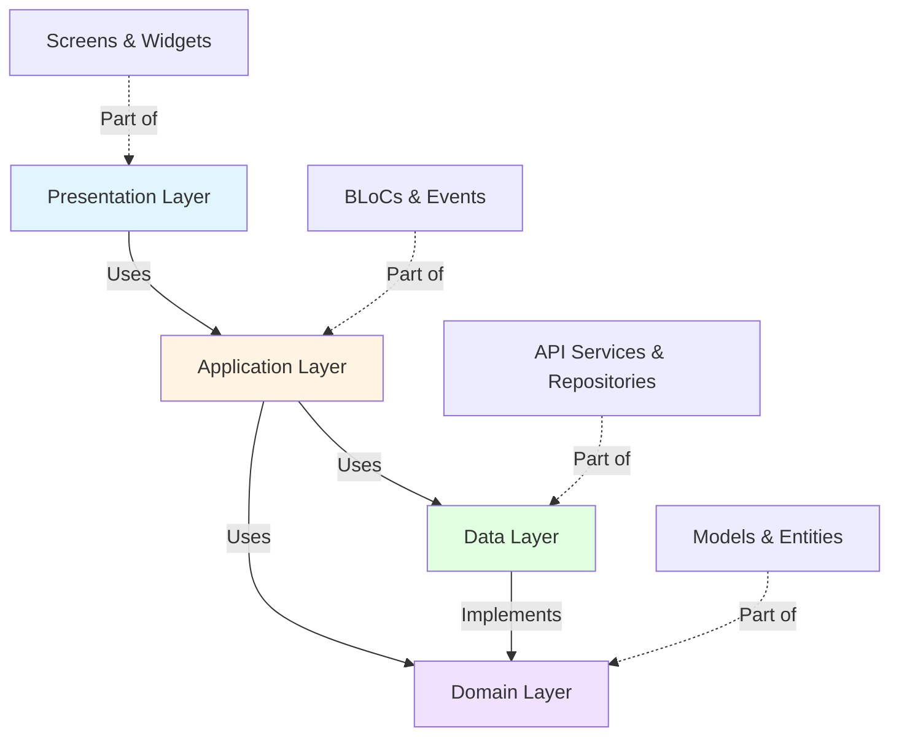

# 🎯 Hotspot Hosts Flutter Assignment

<div align="center">


**A comprehensive Flutter application showcasing modern development practices with Clean Architecture, BLoC pattern, and multi-media capabilities**

[📱 Demo Video](#-demo--screenshots) • [✨ Features](#-core-features-implemented) • [🏗️ Architecture](#️-clean-architecture--project-structure) • [🚀 Getting Started](#-getting-started)

</div>

---

## 📋 Project Overview

This application implements a **two-screen onboarding questionnaire** for **Hotspot Hosts** - individuals who facilitate and manage events at designated locations. The project demonstrates professional Flutter development with emphasis on clean code, scalable architecture, and user experience.

### 🎬 Demo & Screenshots

<div align="center">

### 📺 **Working Demo**
[](https://drive.google.com/file/d/1p_IptZNUv-nrF2p04SEIUdABgJY26Laj/view?usp=sharing)

*Click the badge above to watch the full demo video*

</div>

---

### 📱 Application Screens

<table>
<tr>
<td width="50%">

#### **Screen 1: Experience Selection**
- 🎴 Multi-select experience cards
- 🎨 Grayscale filter on unselected
- 📝 Custom notes input (250 chars)
- ✅ Validation & progress tracking

</td>
<td width="50%">

#### **Screen 2: Question & Answer**
- 📝 Multi-line text input (600 chars)
- 🎤 Audio recording with waveform
- 📹 Video recording with preview
- ▶️ Media playback controls

</td>
</tr>
</table>

---

## ✨ Core Features Implemented

<div align="center">

### 🎯 **100% Requirement Coverage + All Brownie Points**

</div>

### 1️⃣ Experience Type Selection Screen

<table>
<tr>
<td width="50%">

#### 🎴 **Card Features**
- ✅ API-driven experience cards
- ✅ Multi-select functionality
- ✅ Grayscale filter (unselected)
- ✅ Background image from API
- ✅ 120x140px stamp-style design
- ✅ White border accent

</td>
<td width="50%">

#### 📝 **Input & Validation**
- ✅ 250-character text input
- ✅ Live character counter
- ✅ Multi-line support
- ✅ State persistence (BLoC)
- ✅ Validation on Next button
- ✅ Progress indicator (1/3)

</td>
</tr>
</table>

### 2️⃣ Onboarding Question Screen

<table>
<tr>
<td width="33%">

#### 📝 **Text Input**
- ✅ 600-char limit
- ✅ Live counter
- ✅ Multi-line support
- ✅ Real-time validation

</td>
<td width="33%">

#### 🎤 **Audio Recording**
- ✅ Inline recording
- ✅ Waveform visualization
- ✅ Duration counter
- ✅ Play/pause controls
- ✅ Seek functionality
- ✅ Delete option

</td>
<td width="33%">

#### 📹 **Video Recording**
- ✅ Inline camera preview
- ✅ Duration counter
- ✅ Video playback
- ✅ Aspect ratio handling
- ✅ Delete option
- ✅ Permission handling

</td>
</tr>
</table>

#### 🎨 **Dynamic Layout**
- ✅ Media buttons hide when answer exists
- ✅ Next button expands to full width (smooth animation)
- ✅ Progress indicator (2/3)
- ✅ Validation (at least one answer required)

---

## 🎨 Brownie Points Implemented

<div align="center">


</div>

<table>
<tr>
<th width="30%">Category</th>
<th width="70%">Implementation Details</th>
</tr>

<tr>
<td><b>🎨 Pixel-Perfect UI</b></td>
<td>
• Space Grotesk font family throughout<br>
• Exact color palette (#48E5C2, #0A0A0A, etc.)<br>
• Precise spacing (4px, 8px, 12px, 16px, 20px, 32px)<br>
• 8px border radius consistency<br>
• Gradient backgrounds with exact color stops<br>
• Font sizes & weights match Figma design
</td>
</tr>

<tr>
<td><b>🧠 State Management</b></td>
<td>
• <b>BLoC Pattern</b> (flutter_bloc ^9.1.1)<br>
• 3 BLoCs: Experience, Selection, QuestionAnswer<br>
• Event-driven architecture<br>
• Immutable states (Equatable)<br>
• GetIt dependency injection<br>
• Clear separation of concerns
</td>
</tr>

<tr>
<td><b>🌐 API Client</b></td>
<td>
• <b>Dio</b> (^5.9.0) with interceptors<br>
• Logging & error handling<br>
• Repository pattern for data abstraction<br>
• Centralized base URL configuration<br>
• Clean error messages
</td>
</tr>

<tr>
<td><b>✨ Animations</b></td>
<td>
• Card scroll-to-first animation (500ms, easeInOut)<br>
• Next button width transition (300ms, easeInOut)<br>
• AnimatedSize widget for smooth transitions<br>
• ScrollController for horizontal scrolling
</td>
</tr>

<tr>
<td><b>⌨️ Keyboard Handling</b></td>
<td>
• SingleChildScrollView with ConstrainedBox<br>
• IntrinsicHeight for proper calculations<br>
• LayoutBuilder for responsive constraints<br>
• No overflow errors<br>
• Content scrolls smoothly
</td>
</tr>

<tr>
<td><b>▶️ Media Playback</b></td>
<td>
<b>Audio:</b> Play/pause, seek bar, duration display<br>
<b>Video:</b> Native controls, aspect ratio, full-screen
</td>
</tr>

<tr>
<td><b>➕ Extra Features</b></td>
<td>
• Permission handling (camera, microphone)<br>
• Inline recording feedback (real-time)<br>
• Text validation on both screens<br>
• Custom reusable widgets<br>
• Error states with user notifications<br>
• GoRouter for navigation
</td>
</tr>
</table>

---

## 🏗️ Clean Architecture & Project Structure

<div align="center">

### **Architecture Overview**



</div>

### 📂 Project Structure

```
lib/
├── 🎨 screens/                          # Presentation Layer
│   ├── experience_selection_screen.dart  # Screen 1: Experience cards
│   └── question_screen.dart              # Screen 2: Multi-media Q&A
│
├── 🧠 blocs/                             # Application Layer (BLoC Pattern)
│   ├── experience/
│   │   ├── experience_bloc.dart          # Handles API calls
│   │   ├── experience_event.dart         # Events: Fetch, Load, Error
│   │   └── experience_state.dart         # States: Initial, Loading, Loaded, Error
│   ├── selection/
│   │   ├── selection_bloc.dart           # Multi-select logic
│   │   ├── selection_event.dart          # Events: Toggle, Clear
│   │   └── selection_state.dart          # State: Selected IDs list
│   └── question_answer/
│       ├── question_answer_bloc.dart     # Answer management
│       ├── question_answer_event.dart    # Events: Text, Audio, Video
│       └── question_answer_state.dart    # State: Answer data
│
├── 📦 models/                            # Domain Layer
│   ├── experience.dart                   # Experience entity
│   ├── question_answer.dart              # Answer entity
│   └── answer_type.dart                  # Enum: Text, Audio, Video
│
├── 🌐 services/                          # Data Layer
│   └── api_service.dart                  # Dio HTTP client
│
├── 💾 repositories/                      # Data Layer
│   └── experience_repository.dart        # Data access abstraction
│
├── 🛠️ utils/                             # Helper Utilities
│   ├── audio_recorder_helper.dart        # Audio recording logic
│   ├── video_recorder_helper.dart        # Video recording logic
│   └── permission_helper.dart            # Permission management
│
├── 🧩 widgets/                           # Reusable UI Components
│   ├── custom_text_field.dart            # Text input with counter
│   ├── experience_stamp_card.dart        # Stamp-style experience card
│   ├── audio_player_widget.dart          # Audio playback controls
│   ├── video_player_widget.dart          # Video playback controls
│   ├── audio_recorder_widget.dart        # Audio recording UI
│   └── video_recorder_widget.dart        # Video recording UI
│
├── 🎨 core/constants/                    # Design System
│   ├── app_colors.dart                   # Color palette
│   ├── app_text_styles.dart              # Typography
│   ├── app_spacing.dart                  # Spacing constants
│   ├── app_border_radius.dart            # Border radius
│   └── app_theme.dart                    # Theme configuration
│
└── 🚀 main.dart                          # App Entry Point
```

### 🏛️ Clean Architecture Principles

<table>
<tr>
<th width="25%">Layer</th>
<th width="35%">Responsibility</th>
<th width="40%">Components</th>
</tr>

<tr>
<td><b>🎨 Presentation</b></td>
<td>UI rendering and user interactions</td>
<td>
• Screens<br>
• Widgets<br>
• UI Components
</td>
</tr>

<tr>
<td><b>🧠 Application</b></td>
<td>Business logic and state management</td>
<td>
• BLoCs (Business Logic Components)<br>
• Events<br>
• States
</td>
</tr>

<tr>
<td><b>📦 Domain</b></td>
<td>Core business entities and rules</td>
<td>
• Models<br>
• Entities<br>
• Enums
</td>
</tr>

<tr>
<td><b>💾 Data</b></td>
<td>External data sources and APIs</td>
<td>
• API Services<br>
• Repositories<br>
• Data Sources
</td>
</tr>
</table>

### 🔄 BLoC Pattern Flow

```
User Action → Event → BLoC → State → UI Update

Example:
┌─────────────────────────────────────────────────────────┐
│  User taps "Select Experience Card"                      │
└───────────────┬─────────────────────────────────────────┘
                ↓
┌─────────────────────────────────────────────────────────┐
│  SelectionEvent: ToggleExperienceSelection(id)          │
└───────────────┬─────────────────────────────────────────┘
                ↓
┌─────────────────────────────────────────────────────────┐
│  SelectionBloc: Processes event, updates state          │
└───────────────┬─────────────────────────────────────────┘
                ↓
┌─────────────────────────────────────────────────────────┐
│  SelectionState: New state with updated selectedIds     │
└───────────────┬─────────────────────────────────────────┘
                ↓
┌─────────────────────────────────────────────────────────┐
│  BlocBuilder: Rebuilds UI with new state                │
└─────────────────────────────────────────────────────────┘
```

### ✨ Architecture Benefits

- ✅ **Separation of Concerns**: Each layer has a single, well-defined responsibility
- ✅ **Testability**: Business logic is independent of UI and can be easily tested
- ✅ **Maintainability**: Changes in one layer don't affect others
- ✅ **Scalability**: Easy to add new features without breaking existing code
- ✅ **Reusability**: Components can be reused across different parts of the app
- ✅ **Dependency Rule**: Inner layers don't depend on outer layers

---

## 🛠️ Tech Stack

<div align="center">

### **Core Technologies**


</div>

### 📦 Dependencies

<table>
<tr>
<th width="30%">Category</th>
<th width="40%">Package</th>
<th width="30%">Purpose</th>
</tr>

<tr>
<td rowspan="3"><b>🧠 State Management</b></td>
<td><code>flutter_bloc: ^9.1.1</code></td>
<td>Reactive state management</td>
</tr>
<tr>
<td><code>bloc: ^9.1.0</code></td>
<td>Business logic component</td>
</tr>
<tr>
<td><code>equatable: ^2.0.5</code></td>
<td>Value equality</td>
</tr>

<tr>
<td><b>💉 Dependency Injection</b></td>
<td><code>get_it: ^9.0.5</code></td>
<td>Service locator pattern</td>
</tr>

<tr>
<td><b>🧭 Navigation</b></td>
<td><code>go_router: ^17.0.0</code></td>
<td>Declarative routing</td>
</tr>

<tr>
<td rowspan="2"><b>🌐 Networking</b></td>
<td><code>dio: ^5.9.0</code></td>
<td>HTTP client</td>
</tr>
<tr>
<td><code>logger: ^2.6.2</code></td>
<td>Debug logging</td>
</tr>

<tr>
<td rowspan="2"><b>🎙️ Media Recording</b></td>
<td><code>camera: ^0.11.0+2</code></td>
<td>Video recording</td>
</tr>
<tr>
<td><code>record: ^6.1.2</code></td>
<td>Audio recording</td>
</tr>

<tr>
<td rowspan="2"><b>▶️ Media Playback</b></td>
<td><code>audioplayers: ^6.1.0</code></td>
<td>Audio playback</td>
</tr>
<tr>
<td><code>video_player: ^2.9.1</code></td>
<td>Video playback</td>
</tr>

<tr>
<td rowspan="3"><b>🛠️ Utilities</b></td>
<td><code>permission_handler: ^11.3.1</code></td>
<td>Runtime permissions</td>
</tr>
<tr>
<td><code>path_provider: ^2.1.5</code></td>
<td>File system paths</td>
</tr>
<tr>
<td><code>cached_network_image: ^3.4.1</code></td>
<td>Image caching</td>
</tr>
</table>

---

## 🚀 Getting Started

### Prerequisites
- Flutter SDK (>=3.0.0)
- Dart SDK (>=3.0.0)
- Android Studio / Xcode (for mobile development)
- Android Emulator / iOS Simulator / Physical Device

### Installation Steps

1. **Clone the repository**
   ```bash
   git clone https://github.com/DevNebula6/hotspot_hosts_flutter_assignment.git
   cd hotspot_hosts_flutter_assignment
   ```

2. **Install dependencies**
   ```bash
   flutter pub get
   ```

3. **Run the app**
   ```bash
   # For Android
   flutter run -d <android-device-id>
   
   # For iOS
   flutter run -d <ios-device-id>
   
   # For Web (limited functionality - no camera/mic)
   flutter run -d chrome
   ```

### Platform-Specific Setup

#### Android Permissions
Add to `android/app/src/main/AndroidManifest.xml`:
```xml
<manifest>
    <uses-permission android:name="android.permission.INTERNET" />
    <uses-permission android:name="android.permission.CAMERA" />
    <uses-permission android:name="android.permission.RECORD_AUDIO" />
    <uses-permission android:name="android.permission.WRITE_EXTERNAL_STORAGE" />
    <uses-permission android:name="android.permission.READ_EXTERNAL_STORAGE" />
</manifest>
```

#### iOS Permissions
Add to `ios/Runner/Info.plist`:
```xml
<key>NSCameraUsageDescription</key>
<string>We need camera access to record video answers</string>
<key>NSMicrophoneUsageDescription</key>
<string>We need microphone access to record audio and video answers</string>
<key>NSPhotoLibraryUsageDescription</key>
<string>We need photo library access to save recordings</string>
```

---

## 📱 API Integration

### Base URL
```
https://staging.chamberofsecrets.8club.co
```

### Endpoints Used

#### Get Experiences
- **Endpoint**: `/v1/experiences?active=true`
- **Method**: `GET`
- **Response**:
```json
{
  "message": "string",
  "data": {
    "experiences": [
      {
        "id": 0,
        "name": "string",
        "tagline": "string",
        "description": "string",
        "image_url": "string",
        "icon_url": "string"
      }
    ]
  }
}
```

---

## 🎯 Key Implementation Highlights

### 1. State Management with BLoC
```dart
// Event-driven architecture
context.read<SelectionBloc>().add(
  ToggleExperienceSelection(experienceId),
);

// Reactive UI updates
BlocBuilder<QuestionAnswerBloc, QuestionAnswerState>(
  builder: (context, state) {
    return state.hasTextAnswer ? EnabledButton() : DisabledButton();
  },
)
```

### 2. Inline Recording (No Extra Screens)
- Audio and video recording happens directly on the question screen
- Real-time feedback with waveform/camera preview
- Toggle recording by tapping media buttons
- Seamless UX without navigation disruption

### 3. Responsive Layout
```dart
LayoutBuilder(
  builder: (context, constraints) {
    return SingleChildScrollView(
      child: ConstrainedBox(
        constraints: BoxConstraints(
          minHeight: screenHeight - topPadding - appBarHeight,
        ),
        child: IntrinsicHeight(...),
      ),
    );
  },
)
```

### 4. Smooth Animations
```dart
// Card scroll animation
scrollController.animateTo(
  index * cardWidth,
  duration: const Duration(milliseconds: 500),
  curve: Curves.easeInOut,
);

// Button width transition
AnimatedSize(
  duration: const Duration(milliseconds: 300),
  curve: Curves.easeInOut,
  child: NextButton(...),
)
```

---

## 🎨 Design System

### Colors
- Primary Accent: `#48E5C2`
- Background: `#0A0A0A`
- Surface: `#1C1C1C`
- Text Primary: `#FFFFFF`
- Text Secondary: `#B8B8B8`
- Border: `#333333`
- Error: `#FF6B6B`

### Typography (Space Grotesk)
- H2 Bold: 24px, Weight 700
- Body Bold: 14px, Weight 700
- Body Regular: 13px, Weight 400
- Button Bold: 20px, Weight 700

### Spacing System
- xs: 4px
- sm: 8px
- md: 12px
- lg: 16px
- xl: 20px
- xxl: 32px

---

## 📊 Project Statistics

- **Total Screens**: 2 main screens
- **BLoCs**: 3 (Experience, Selection, QuestionAnswer)
- **Custom Widgets**: 8+
- **Lines of Code**: ~2,500+
- **Dependencies**: 20+
- **Development Time**: Comprehensive implementation

---

## 🚧 Known Limitations & Future Enhancements

### Current Limitations
- Video recording tested primarily on Android
- Large video files not optimized for upload

### Potential Enhancements
- Unit and widget tests
- Integration tests for BLoCs
- Video compression before upload
- Offline mode with local storage
- Multi-language support
- Accessibility improvements (screen readers, contrast)

---

## 📝 Assignment Completion Summary

<table>
<tr>
<th width="40%">Requirement</th>
<th width="15%">Status</th>
<th width="45%">Implementation Notes</th>
</tr>

<tr>
<td><b>Experience Selection Screen</b></td>
<td align="center">✅</td>
<td>Multi-select cards, grayscale filter, text input with validation</td>
</tr>

<tr>
<td><b>Question Screen</b></td>
<td align="center">✅</td>
<td>Text, audio, video support with inline recording</td>
</tr>

<tr>
<td><b>Audio Recording</b></td>
<td align="center">✅</td>
<td>Waveform visualization, inline UI, playback controls</td>
</tr>

<tr>
<td><b>Video Recording</b></td>
<td align="center">✅</td>
<td>Camera preview, inline UI, playback with controls</td>
</tr>

<tr>
<td><b>Delete Media</b></td>
<td align="center">✅</td>
<td>Delete functionality for both audio and video</td>
</tr>

<tr>
<td><b>State Management (BLoC)</b></td>
<td align="center">✅</td>
<td>3 BLoCs with events and states, GetIt injection</td>
</tr>

<tr>
<td><b>API Integration (Dio)</b></td>
<td align="center">✅</td>
<td>Dio client with interceptors and error handling</td>
</tr>

<tr>
<td><b>Pixel-Perfect UI</b></td>
<td align="center">✅</td>
<td>Matches Figma design (fonts, colors, spacing)</td>
</tr>

<tr>
<td><b>Animations</b></td>
<td align="center">✅</td>
<td>Card scroll animation, button width transitions</td>
</tr>

<tr>
<td><b>Keyboard Handling</b></td>
<td align="center">✅</td>
<td>Responsive layouts with proper scroll behavior</td>
</tr>

<tr>
<td><b>Media Playback</b></td>
<td align="center">✅</td>
<td>Custom audio/video players with full controls</td>
</tr>
</table>

<div align="center">

**All Optional Features Implemented Successfully!**

</div>

---

## 📊 Project Metrics

<div align="center">

<table>
<tr>
<td align="center"><b>📱 Screens</b><br><font size="5">2</font></td>
<td align="center"><b>🧠 BLoCs</b><br><font size="5">3</font></td>
<td align="center"><b>🧩 Widgets</b><br><font size="5">8+</font></td>
<td align="center"><b>📦 Models</b><br><font size="5">3</font></td>
</tr>
<tr>
<td align="center"><b>📄 LOC</b><br><font size="5">2,500+</font></td>
<td align="center"><b>📚 Dependencies</b><br><font size="5">20+</font></td>
<td align="center"><b>🎨 Colors</b><br><font size="5">15+</font></td>
<td align="center"><b>✅ Completion</b><br><font size="5">100%</font></td>
</tr>
</table>

</div>

---

## 👨‍💻 Developer Information

<div align="center">

**Vineet Prakash Diwakar**

[](mailto:vineet.inbox26@gmail.com)
[](https://github.com/DevNebula6)

</div>

---
